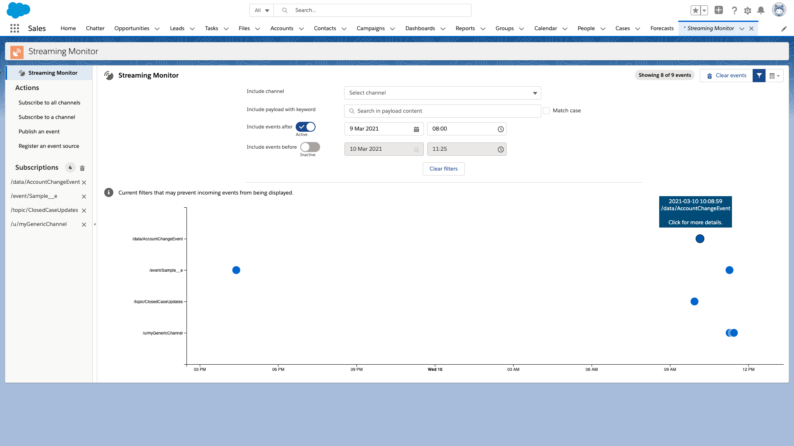
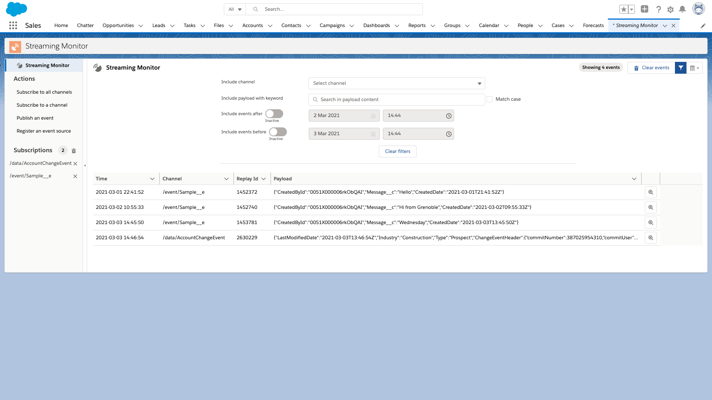
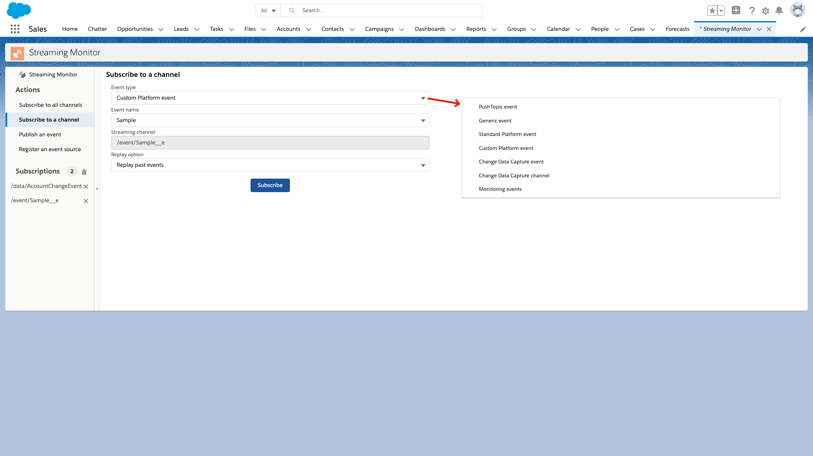
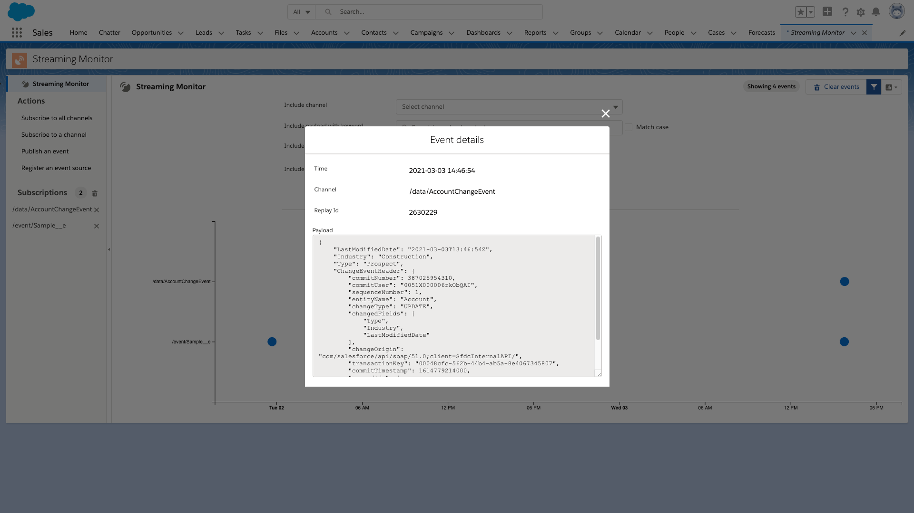
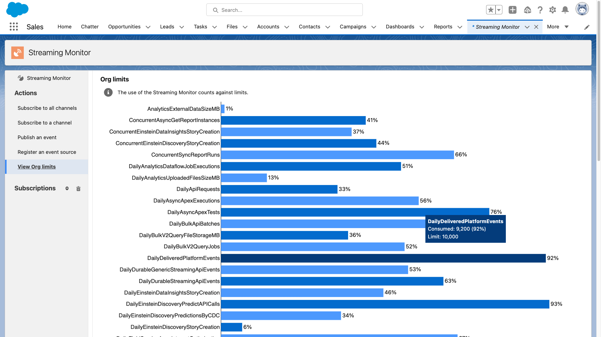

# Streaming Monitor ([AppExchange](https://appexchange.salesforce.com/appxListingDetail?listingId=a0N3A00000FYEEWUA5))

[](https://github.com/pozil/streaming-monitor/actions) [](https://codecov.io/gh/pozil/streaming-monitor)

This Lightning App allows to monitor streaming events: PushTopic events, generic events, standard and custom platform events, Change Data Capture events, and monitoring events.

📺&nbsp;&nbsp;[Presentation Video](https://youtu.be/OTsePo1zMxE)

Features:

-   Subscribe to all streaming events (event types are automatically discovered)
-   Subscribe to and unsubscribe from specific streaming events with a user-friendly UI
-   Publish an event (generic events and platform events)
-   Register an event source (instructions and shortcuts)
-   Analyze past event content with
    -   timeline or table view
    -   dynamic filters
    -   flexible replay options
-   View org limits and event usage metrics

The app leverages the [lighnting-emp-api](https://developer.salesforce.com/docs/component-library/bundle/lightning-emp-api/documentation) Lightning Web Component for streaming event subscriptions and [D3.js](https://d3js.org/) to draw a dynamic event timeline.



<br/>
<details><summary><b> Click here for more screenshots 🖼</b></summary>
    <br/>
    <p></p>
    <p></p>
    <p></p>
    <p></p>
</details>
<br/>

## Installation

Get the Streaming Monitor from the [AppExchange](https://appexchange.salesforce.com/appxListingDetail?listingId=a0N3A00000FYEEWUA5) (recommended for automatic updates) or install it manually with the following procedure.

1. Install the app by running this script:

    **MacOS or Linux**

    ```
    ./install-dev.sh
    ```

    **Windows**

    ```
    install-dev.bat
    ```

2. Open the **Streaming Monitor** tab.
