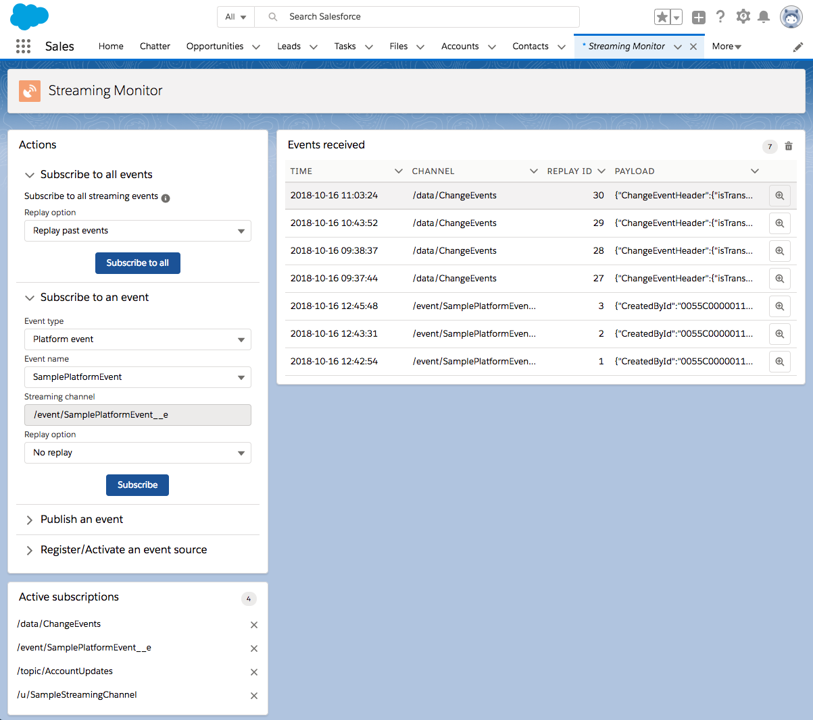

# Streaming Monitor ([AppExchange](https://appexchange.salesforce.com/appxListingDetail?listingId=a0N3A00000FYEEWUA5))

This Lightning App allows to monitor streaming events: PushTopic events, generic events, platform events and CDC events.

Features:
- Subscribe to all streaming events (event types are automatically discovered)
- Subscribe to and unsubscribe from specific streaming events with a user-friendly UI
- Publish an event (Generic events and platform events)
- Register an event source (instructions and shortcuts)
- Analyze past event content with flexible replay options

The app leverages the [lighnting:empApi](https://developer.salesforce.com/docs/component-library/bundle/lightning:empApi/documentation) service component for streaming event subscriptions.



## Installation

Get the Streaming Monitor from the [AppExchange](https://appexchange.salesforce.com/appxListingDetail?listingId=a0N3A00000FYEEWUA5) or install it manually with the following procedure.

### Unix

Execute the `install-dev.sh` bash script and open the **Streaming Monitor** tab.

### Other OS

Execute these Salesforce DX commands:

a) create a scratch org with a "streaming" alias:
```sh
sfdx force:org:create -s -f config/project-scratch-def.json -a streaming
```

b) install Server Action Service dependency:
```sh
sfdx force:package:install --package 04t1t000000XfCt -w 10 -u streaming
```

c) push sources to the scratch org:
```sh
sfdx force:source:push -u streaming
```

d) assign permission set to the default user:
```sh
sfdx force:user:permset:assign -n Streaming_Monitor -u streaming
```

Open the **Streaming Monitor** tab.
